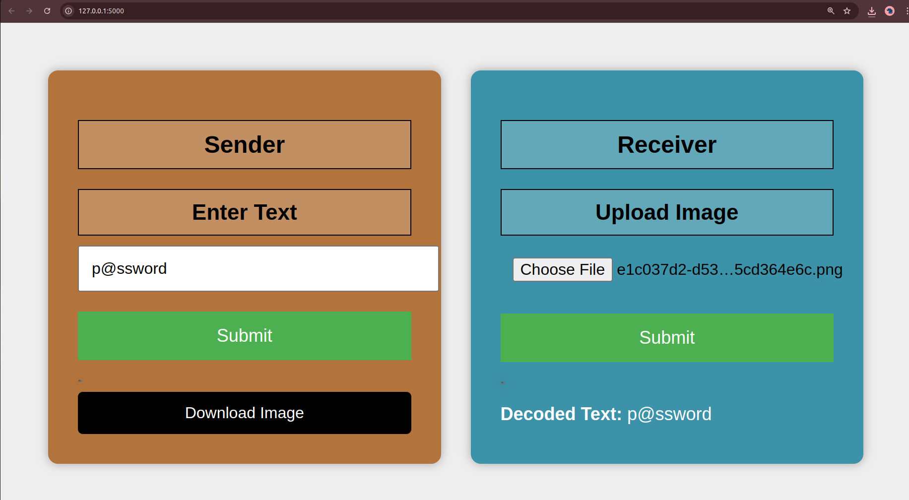

# 🛡️ CipherFrame  
"Give your message a path into encrypted silence"

Welcome to CipherFrame — a secure, image-based text encryption-decryption system. Designed to protect sensitive messages from prying eyes, CipherFrame transforms your message into a seemingly ordinary image that only the receiver can decode using our tool. Perfect for secure communication via email, WhatsApp, Telegram,Messenger or any medium where image files are allowed.

---

## 🚀 Project Highlights

🔐 Innovative Encryption Scheme  
✔ Converts messages into grayscale images using ASCII values.  
✔ Applies encryption using real-valued roots from dynamically generated quadratic equations.  
✔ Keys are stored and mapped securely via a unique image ID.

🎯 Key Features  
- Real-time text-to-image encryption  
- Easy and intuitive decryption using image upload  
- Clean, user-friendly web interface using Flask  
- JSON-based key mapping for enhanced security  
- Image padding and reshaping for accurate decoding  

---

## ⚙️ How It Works

1. ✍️ Sender enters a message into the text box.  
2. 🖼️ System encrypts the message, generates a grayscale image, and allows the user to download it.  
3. 📄 The image can be sent via any communication platform.  
4. 📩 Receiver uploads the image to our system.  
5. 🔓 The system retrieves the image's encryption key from a secure JSON map and decodes it back to the original message.

---

## 🧠 Behind the Logic

📂 Custom Encryption Logic
- A quadratic equation with guaranteed real roots is dynamically generated for each message.
- The root of the polynomial is used as a key to uniformly shift ASCII values.
- This key is stored against a UUID-based image name in a secure JSON file.
- The same key is used in decryption to reverse the shift.

📷 Image Generation
- Message → ASCII → Encrypted values → Reshaped to matrix → Saved as image
- Image pixels hold encrypted ASCII values.
- Padding ensures matrix consistency for display and decode accuracy.

---

## 💻 UI Snapshot

Here’s how CipherFrame looks in action:



---

## How to Use

1. Clone the repository:
   ```bash
   git clone https://github.com/rajkumarmaity23/CipherFrame.git
   cd CipherFrame
   ```

2. Run the application:
   ```bash
   python Backend.py
   ```

3. Open your browser and go to:
   ```
   http://127.0.0.1:5000
   ```

---

## 📌 System Requirements

- Python 3.7+
- Flask
- NumPy, Pillow, OpenCV, SymPy

Install dependencies:
```bash
pip install -r requirements.txt
```

---

## 🤝 Get Involved

We welcome contributions that can improve CipherFrame!  
If you find a bug, have ideas for improvement, or want to contribute new features, feel free to fork the repo and create a pull request.

---

## 🙏 Acknowledgements

Special thanks to the open-source community. Your support and tools made CipherFrame possible. Together, let’s redefine secure communication!

---

🔐 CipherFrame – Because privacy isn't a feature. It's a right.

